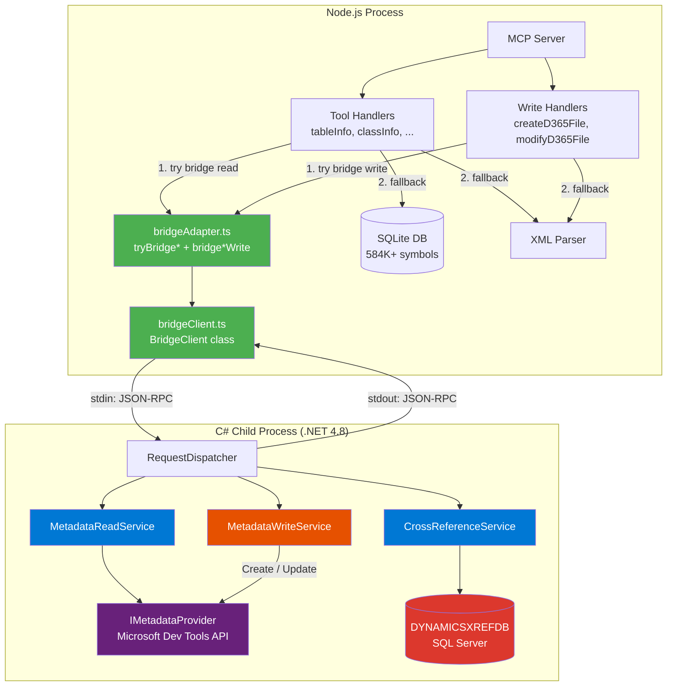
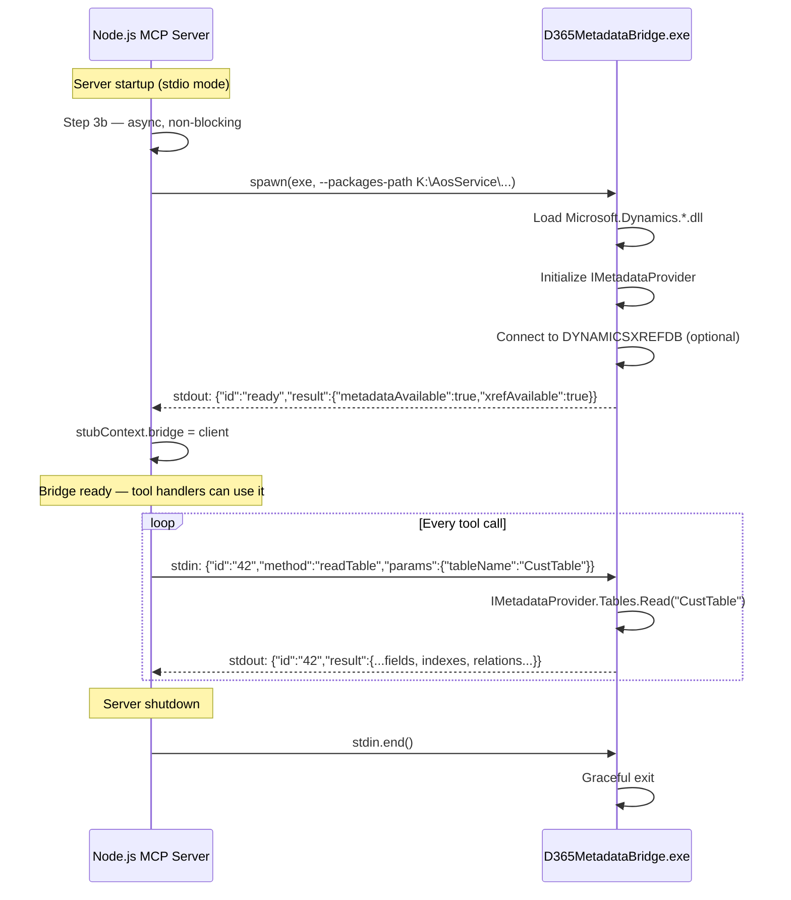

# C# Metadata Bridge

The C# Metadata Bridge connects the Node.js MCP server to Microsoft's official
D365 Finance & Operations Dev Tools API (`IMetadataProvider`) and cross-reference
database (`DYNAMICSXREFDB`) via a .NET Framework 4.8 child process.

It provides **live, always-current** metadata access on Windows D365FO development
VMs. On Azure/Linux deployments where D365FO is not installed, the bridge is
simply absent and the server falls back to its pre-built SQLite index — there is
zero behavioral change.

---

## Table of Contents

- [Why a Bridge?](#why-a-bridge)
- [Architecture](#architecture)
- [Process Lifecycle](#process-lifecycle)
- [Integration into Tool Handlers](#integration-into-tool-handlers)
- [Write Operations (Phase 4)](#write-operations-phase-4)
- [Request Flow — End to End](#request-flow--end-to-end)
- [JSON-RPC Protocol](#json-rpc-protocol)
- [C# Components](#c-components)
- [TypeScript Components](#typescript-components)
- [Supported Endpoints](#supported-endpoints)
- [Data Source Comparison](#data-source-comparison)
- [Deployment Scenarios](#deployment-scenarios)
- [Configuration](#configuration)
- [Building the Bridge](#building-the-bridge)
- [Testing](#testing)
- [Troubleshooting](#troubleshooting)

---

## Why a Bridge?

The existing MCP server uses a **pre-built SQLite database** containing 584,799+
symbols extracted from D365FO metadata XML files. This works everywhere (Azure,
Linux, CI/CD), but has limitations:

| Limitation | Bridge Solution |
|---|---|
| Data is a point-in-time snapshot (stale after code changes) | Live API reads current runtime metadata |
| XML parsing is fragile (ISV models may use non-standard structures) | Microsoft's own parser handles all edge cases |
| Cross-references are approximated via FTS text search | Exact compiler cross-references from `DYNAMICSXREFDB` |
| No access to computed/inherited properties | `IMetadataProvider` resolves full inheritance chains |

The bridge is an **additive enhancement** — it does not replace any existing logic.

---

## Architecture



---

## Process Lifecycle



**Startup is non-blocking.** The bridge is initialized inside `void (async () => { ... })()` in
`src/index.ts` (Step 3b). The MCP server is fully operational immediately — the SQLite
database loads in parallel (Step 4). When the bridge becomes ready, it is assigned to
`stubContext.bridge` and tool handlers begin using it automatically.

If the bridge fails to start (no D365FO installed, missing DLLs, wrong path), a one-line
info message is logged and the server continues with SQLite-only mode.

---

## Integration into Tool Handlers

Every read-only tool handler follows the same **try-first, fall-through** pattern:

```typescript
// Example: src/tools/tableInfo.ts

import { tryBridgeTable } from '../bridge/bridgeAdapter.js';

export async function tableInfoTool(request, context) {
    const args = TableInfoArgsSchema.parse(request.params.arguments);

    // ① Cache hit → return immediately (unchanged)
    const cached = await cache.get(cacheKey);
    if (cached) return formatCached(cached);

    // ② Bridge attempt → returns result or null
    const bridgeResult = await tryBridgeTable(context.bridge, args.tableName, args.methodOffset);
    if (bridgeResult) return bridgeResult;

    // ③ Existing SQLite + XML parser logic (completely unchanged)
    const tableSymbol = symbolIndex.getSymbolByName(args.tableName, 'table');
    const tableInfo = await parser.parseTableFile(tableSymbol.filePath, tableSymbol.model);
    // ... format and return
}
```

The `tryBridge*()` functions in `bridgeAdapter.ts` return `null` when:
- `context.bridge` is `undefined` (bridge not connected)
- `bridge.isReady` is `false` (process died or not yet initialized)
- The bridge call threw an error (caught and logged, returns `null`)
- The object was not found (bridge returned `null`)

In all of these cases, the existing logic runs as if the bridge didn't exist.

### Integrated Tool Handlers

| Tool | Adapter Function | Bridge Data Source |
|---|---|---|
| `get_table_info` | `tryBridgeTable()` | `IMetadataProvider.Tables` |
| `get_class_info` | `tryBridgeClass()` | `IMetadataProvider.Classes` |
| `get_method_source` | `tryBridgeMethodSource()` | `IMetadataProvider.Classes` |
| `get_form_info` | `tryBridgeForm()` | `IMetadataProvider.Forms` |
| `get_enum_info` | `tryBridgeEnum()` | `IMetadataProvider.Enums` |
| `get_edt_info` | `tryBridgeEdt()` | `IMetadataProvider.Edts` |
| `get_query_info` | `tryBridgeQuery()` | `IMetadataProvider.Queries` |
| `get_view_info` | `tryBridgeView()` | `IMetadataProvider.Views` |
| `get_data_entity_info` | `tryBridgeDataEntity()` | `IMetadataProvider.DataEntityViews` |
| `get_report_info` | `tryBridgeReport()` | `IMetadataProvider.Reports` (fallback only) |
| `find_references` | `tryBridgeReferences()` | `DYNAMICSXREFDB` |
| `search` | `tryBridgeSearch()` | `IMetadataProvider` (multi-type) |

### Write Tool Handlers (Phase 4)

`create_d365fo_file` and `modify_d365fo_file` now use the bridge as **primary write
path** for supported object types. The bridge writes via `IMetadataProvider.Create()`
and `IMetadataProvider.Update()` — the official D365FO API — guaranteeing correct XML
structure, encoding, and AOT path.

| Tool | Adapter Function | Supported Types | Bridge API |
|---|---|---|---|
| `create_d365fo_file` | `bridgeCreateObject()` | class, table, enum, edt | `IMetaXxxProvider.Create()` |
| `modify_d365fo_file` | `bridgeAddMethod()` | class, table, enum, edt | Read → Modify → `Update()` |
| `modify_d365fo_file` | `bridgeAddField()` | table | Read → Modify → `Update()` |
| `modify_d365fo_file` | `bridgeSetProperty()` | class, table, enum, edt | Read → Modify → `Update()` |
| `modify_d365fo_file` | `bridgeReplaceCode()` | class, table, enum, edt | Read → Modify → `Update()` |

The pattern is identical to reads — **try bridge first, fall back to TypeScript**:

```typescript
// In createD365File.ts — for class, table, enum, edt:
if (!args.xmlContent && context?.bridge && canBridgeCreate(args.objectType)) {
  const result = await bridgeCreateObject(context.bridge, { objectType, objectName, modelName, ... });
  if (result?.success) return result;   // ✅ Bridge wrote the file
}
// Fall through to TypeScript XML generation (forms, reports, extensions, ...)
```

```typescript
// In modifyD365File.ts — for supported operations:
if (!dryRun && context?.bridge && canBridgeModify(objectType, operation)) {
  const result = await bridgeAddMethod(context.bridge, objectType, objectName, ...);
  if (result?.success) return result;   // ✅ Bridge modified the file
}
// Fall through to xml2js-based modification
```

> **Note:** `dryRun` mode always uses the TypeScript xml2js path because the bridge
> writes directly to disk via `IMetadataProvider.Update()` — it cannot produce a
> diff preview without making changes.

### Tools NOT Using the Bridge

These tools use specialized logic that doesn't benefit from the bridge:

- `generate_smart_table`, `generate_smart_form`, `generate_smart_report` — AI code generation
- `analyze_extension_points`, `recommend_extension_strategy` — analysis heuristics
- `find_coc_extensions`, `find_event_handlers` — SQLite FTS pattern matching
- `create_d365fo_file` for forms, reports, security, menu items, extensions — remain in TypeScript
- `modify_d365fo_file` for add-index, add-relation, add-field-group, add-control, rename-field — remain in xml2js

---

## Write Operations (Phase 4)

Phase 4 moved create and modify logic from manual TypeScript XML generation to the
official `IMetadataProvider.Create()` / `Update()` API via the C# bridge. This
eliminates an entire class of XML formatting bugs (wrong encoding, missing CDATA
wrappers, incorrect AOT paths, etc.).

### Discovery: DiskProvider Supports Writes

The D365FO `DiskProvider` (implementation of `IMetadataProvider`) was initially assumed
to be read-only. Probing revealed that `Create()`, `Update()`, and `Delete()` are all
functional — they are simply **explicit interface implementations**, which is why
dynamic dispatch fails:

```csharp
// ❌ Dynamic fails — RuntimeBinderException (explicit interface implementation)
dynamic classes = provider.Classes;
classes.Create(axClass, modelSaveInfo);

// ✅ Interface cast works — file written to disk
var typed = provider.Classes as IMetaClassProvider;
typed.Create(axClass, modelSaveInfo);
```

### Supported Object Types

| Object Type | Create | Modify (add-method, add-field, set-property, replace-code) |
|---|---|---|
| Class | ✅ `IMetaClassProvider.Create()` | ✅ Read → Modify → `Update()` |
| Table | ✅ `IMetaTableProvider.Create()` | ✅ Read → Modify → `Update()` |
| Enum | ✅ `IMetaEnumProvider.Create()` | ✅ Read → Modify → `Update()` |
| EDT | ✅ `IMetaEdtProvider.Create()` | ✅ Read → Modify → `Update()` |
| Form | — (TypeScript XML) | — (xml2js) |
| Report | — (TypeScript XML) | — (xml2js) |
| Extensions | — (TypeScript XML) | — (xml2js) |

### ModelSaveInfo Resolution

Both `Create()` and `Update()` require a `ModelSaveInfo` with valid `Id` and `Layer`.
The `MetadataWriteService.ResolveModelSaveInfo(modelName)` method obtains these by
scanning model descriptor XML files at:

```
{packagesPath}/{packageName}/Descriptor/{modelName}.xml
```

It parses the `<Id>` and `<Layer>` elements from the descriptor. The resolved info is
cached for subsequent calls.

### Fallback Strategy

The bridge-first write path is **non-destructive**: if the bridge is unavailable,
returns an error, or doesn't support the object type, the existing TypeScript code
path runs exactly as before:

```
create_d365fo_file("class", "MyClass", ...)
  ├─ canBridgeCreate("class") → true
  ├─ bridgeCreateObject(bridge, params)
  │   ├─ Bridge available? → yes
  │   ├─ C#: IMetaClassProvider.Create(axClass, modelSaveInfo)
  │   └─ ✅ Return { success: true, filePath: "..." }
  └─ Early return with bridge result

create_d365fo_file("form", "MyForm", ...)
  ├─ canBridgeCreate("form") → false
  └─ Skip bridge → TypeScript XmlTemplateGenerator.generate(...)
```

---

## Request Flow — End to End

Here is what happens when an AI client calls `get_table_info("CustTable")`:

```
┌──────────────────────────────────────────────────────────────────────┐
│  1. IDE sends MCP tool call: get_table_info({tableName:"CustTable"})│
└───────────────────────────────┬──────────────────────────────────────┘
                                │
                                ▼
┌──────────────────────────────────────────────────────────────────────┐
│  2. tableInfoTool() — check cache                                    │
│     Cache miss → continue                                            │
└───────────────────────────────┬──────────────────────────────────────┘
                                │
                                ▼
┌──────────────────────────────────────────────────────────────────────┐
│  3. tryBridgeTable(context.bridge, "CustTable")                      │
│     ├─ bridge.isReady? ✅                                            │
│     ├─ bridge.readTable("CustTable")                                 │
│     │   ├─ JSON-RPC → stdin:  {"id":"1","method":"readTable",        │
│     │   │                      "params":{"tableName":"CustTable"}}   │
│     │   ├─ C#: IMetadataProvider.Tables.Read("CustTable")            │
│     │   ├─ C#: Map fields, indexes, relations, methods → JSON        │
│     │   └─ JSON-RPC ← stdout: {"id":"1","result":{...}}              │
│     ├─ formatTable() → markdown with fields/indexes/relations        │
│     └─ return { content: [{type:'text', text: markdown}] }           │
│                                                                      │
│  ✅ DONE — SQLite/parser code never executes                         │
└──────────────────────────────────────────────────────────────────────┘
```

If the bridge is unavailable, step 3 returns `null` in ~0ms and the flow continues:

```
┌──────────────────────────────────────────────────────────────────────┐
│  3. tryBridgeTable(undefined, "CustTable")                           │
│     └─ !bridge?.isReady → return null                                │
└───────────────────────────────┬──────────────────────────────────────┘
                                │
                                ▼
┌──────────────────────────────────────────────────────────────────────┐
│  4. symbolIndex.getSymbolByName("CustTable", "table")                │
│     → SQLite query → {filePath, model}                               │
│  5. parser.parseTableFile(filePath, model)                           │
│     → Read XML, extract fields/indexes/relations/methods             │
│  6. Format markdown, cache, return                                   │
└──────────────────────────────────────────────────────────────────────┘
```

---

## JSON-RPC Protocol

Communication between Node.js and the C# process uses **newline-delimited JSON-RPC**
over stdin (requests) and stdout (responses). Stderr is reserved for diagnostics.

### Request Format

```json
{
  "id": "42",
  "method": "readTable",
  "params": {
    "tableName": "CustTable"
  }
}
```

### Response Format (success)

```json
{
  "id": "42",
  "result": {
    "name": "CustTable",
    "label": "Customers",
    "model": "ApplicationSuite",
    "fields": [...],
    "indexes": [...],
    "relations": [...]
  }
}
```

### Response Format (error)

```json
{
  "id": "42",
  "error": {
    "code": -32001,
    "message": "Object not found"
  }
}
```

### Special Messages

| Message | Direction | Purpose |
|---|---|---|
| `{"id":"ready","result":{...}}` | C# → Node | Sent once after initialization. Contains `metadataAvailable` and `xrefAvailable` flags. |
| `{"id":"N","method":"ping"}` | Node → C# | Health check. Returns `"pong"`. |
| `{"id":"N","method":"getInfo"}` | Node → C# | Returns version, capabilities, and status. |

### Error Codes

| Code | Meaning |
|---|---|
| `-32601` | Unknown method |
| `-32602` | Invalid/missing parameters |
| `-32000` | Service not available (metadata or xref) |
| `-32001` | Object not found |
| `-32603` | Internal error |

---

## C# Components

Located in `bridge/D365MetadataBridge/`:

```
D365MetadataBridge/
├── Program.cs                      Entry point — arg parsing, DLL loading, process loop
├── D365MetadataBridge.csproj       .NET Framework 4.8 project
├── Protocol/
│   ├── BridgeProtocol.cs           Request/Response/Error JSON models + GetParam<T> helpers
│   └── RequestDispatcher.cs        Routes methods to read/write service handlers
├── Services/
│   ├── MetadataReadService.cs      IMetadataProvider wrapper — read operations
│   ├── MetadataWriteService.cs     IMetadataProvider wrapper — create/modify operations (Phase 4)
│   └── CrossReferenceService.cs    DYNAMICSXREFDB SQL queries
└── Models/
    └── Models.cs                   C# POCOs matching TypeScript bridge types
```

### MetadataReadService

Wraps `Microsoft.Dynamics.AX.Metadata.MetaModel.IMetadataProvider` with typed
read methods:

| Method | D365FO API Used | Returns |
|---|---|---|
| `ReadTable(name)` | `provider.Tables.Read(name)` | Fields, indexes, relations, methods |
| `ReadClass(name)` | `provider.Classes.Read(name)` | Declaration, methods with source, inheritance |
| `ReadEnum(name)` | `provider.Enums.Read(name)` | Values with labels and integer values |
| `ReadEdt(name)` | `provider.Edts.Read(name)` | Base type, extends, constraints |
| `ReadForm(name)` | `provider.Forms.Read(name)` | Data sources, control tree |
| `ReadQuery(name)` | `provider.Queries.Read(name)` | Data sources, ranges, sorting |
| `ReadView(name)` | `provider.Views.Read(name)` | Fields, data sources |
| `ReadDataEntity(name)` | `provider.DataEntityViews.Read(name)` | Fields, keys, data sources |
| `ReadReport(name)` | `provider.Reports.Read(name)` | Datasets, parameters, designs |
| `GetMethodSource(class, method)` | `provider.Classes.Read(class)` | Full X++ source of one method |
| `SearchObjects(type, query, max)` | Iterates `provider.*.GetPrimaryKeys()` | Matching object names |
| `ListObjects(type)` | `provider.*.GetPrimaryKeys()` | All object names of a type |

### MetadataWriteService (Phase 4)

Wraps `IMetadataProvider` for **write operations** — creating new objects and modifying
existing ones. Uses the same provider instance as `MetadataReadService` via the
`OnProviderRefreshed` callback mechanism.

**Key design decisions:**

1. **Explicit interface casts** — DiskProvider implements `Create()`/`Update()` as
   explicit interface members. The service casts to `IMetaClassProvider`,
   `IMetaTableProvider`, `IMetaEnumProvider`, `IMetaEdtProvider` to access them.

2. **ModelSaveInfo resolution** — `ResolveModelSaveInfo(modelName)` scans model
   descriptor XML files at `{packagesPath}/{pkg}/Descriptor/{model}.xml` to obtain
   a valid `Id` + `Layer` required by `Create()`/`Update()`.

3. **AxEdt is abstract** — EDT creation selects the concrete subtype (`AxEdtString`,
   `AxEdtInt`, `AxEdtReal`, `AxEdtDate`, etc.) based on the `BaseType` property.

4. **Read→Modify→Update pattern** — For modify operations (`AddMethod`, `AddField`,
   `SetProperty`, `ReplaceCode`), the service reads the current object via
   `provider.Xxx.Read(name)`, mutates the in-memory object, then calls
   `((IMetaXxxProvider)provider.Xxx).Update(obj, modelSaveInfo)` to persist.

| Method | Objects | API Used |
|---|---|---|
| `CreateClass(name, model, declaration, methods)` | AxClass | `IMetaClassProvider.Create()` |
| `CreateTable(name, model, fields, indexes, ...)` | AxTable | `IMetaTableProvider.Create()` |
| `CreateEnum(name, model, values, properties)` | AxEnum | `IMetaEnumProvider.Create()` |
| `CreateEdt(name, model, baseType, properties)` | AxEdt* | `IMetaEdtProvider.Create()` |
| `AddMethod(type, name, methodName, source)` | class/table | Read → `Update()` |
| `AddField(tableName, fieldName, fieldType, ...)` | table | Read → `Update()` |
| `SetProperty(type, name, path, value)` | class/table/enum/edt | Read → `Update()` |
| `ReplaceCode(type, name, method, old, new)` | class/table | Read → `Update()` |

### CrossReferenceService

Connects to `DYNAMICSXREFDB` on the local SQL Server (or a configured instance) and
executes cross-reference queries:

| Method | SQL Table | Returns |
|---|---|---|
| `FindReferences(path)` | `References`, `Names`, `Path` | All callers/references to an object |
| `GetSchemaInfo()` | `INFORMATION_SCHEMA` | Available tables and columns |
| `SampleRows(table)` | Any table | Sample data for debugging |

### DLL Loading

The bridge loads Microsoft assemblies at runtime from the D365FO packages directory:

```
{packagesPath}/bin/
├── Microsoft.Dynamics.AX.Metadata.dll
├── Microsoft.Dynamics.AX.Metadata.Core.dll
├── Microsoft.Dynamics.AX.Metadata.Storage.dll
├── Microsoft.Dynamics.ApplicationPlatform.Xti.Server.dll
└── ... (additional dependencies resolved via AssemblyResolve)
```

`Program.cs` registers an `AppDomain.CurrentDomain.AssemblyResolve` handler to find
these DLLs automatically. For UDE environments, a separate `--bin-path` argument
points to the Microsoft framework bin directory.

---

## TypeScript Components

Located in `src/bridge/`:

```
src/bridge/
├── index.ts              Barrel exports for all bridge types and functions
├── bridgeClient.ts       BridgeClient class — spawn, JSON-RPC, typed methods
├── bridgeTypes.ts        ~40 TypeScript interfaces matching C# models (incl. write types)
└── bridgeAdapter.ts      12 tryBridge*() read adapters + 7 bridge*() write adapters
```

### BridgeClient (`bridgeClient.ts`)

Singleton class managing the child process lifecycle:

- **`initialize()`** — Spawns the `.exe`, waits for the `"ready"` JSON message (30s timeout)
- **`call<T>(method, params)`** — Sends JSON-RPC request, returns typed promise (60s timeout)
- **`dispose()`** — Gracefully shuts down the child process
- **14 typed read methods** — `readTable()`, `readClass()`, `findReferences()`, etc.
- **5 typed write methods** — `createObject()`, `addMethod()`, `addField()`, `setProperty()`, `replaceCode()`

Properties:
- `isReady` — Process is running and initialized
- `metadataAvailable` — `IMetadataProvider` API loaded successfully
- `xrefAvailable` — `DYNAMICSXREFDB` connection is active

### Bridge Types (`bridgeTypes.ts`)

TypeScript interfaces that mirror the C# model classes:

```typescript
interface BridgeTableInfo {
  name: string;
  label?: string;
  model?: string;
  tableGroup?: string;
  fields: BridgeFieldInfo[];
  indexes: BridgeIndexInfo[];
  relations: BridgeRelationInfo[];
  methods: BridgeMethodInfo[];
  // ...
}
```

### Bridge Adapter (`bridgeAdapter.ts`)

Twelve `tryBridge*()` read functions plus seven `bridge*()` write functions. Each:

1. Checks `bridge?.isReady` (and `bridge.metadataAvailable` or `bridge.xrefAvailable`)
2. Calls the appropriate bridge method
3. Formats the response into markdown matching the tool's existing output style
4. Returns a `ToolResult` object — or `null` to signal fallback

```typescript
export async function tryBridgeTable(
  bridge: BridgeClient | undefined,
  tableName: string,
  methodOffset = 0,
): Promise<ToolResult | null> {
  if (!bridge?.isReady || !bridge.metadataAvailable) return null;
  try {
    const t = await bridge.readTable(tableName);
    if (!t) return null;
    return { content: [{ type: 'text', text: formatTable(t, methodOffset) }] };
  } catch (e) {
    console.error(`[BridgeAdapter] readTable(${tableName}) failed: ${e}`);
    return null;     // ← fallback to SQLite
  }
}
```

All bridge-sourced output includes a `_Source: C# bridge (IMetadataProvider)_` marker
so the AI client can distinguish it from SQLite-sourced data.

---

## Supported Endpoints

### Read Endpoints

| Method | Parameters | Response Type | Source |
|---|---|---|---|
| `ping` | — | `"pong"` | Health |
| `getInfo` | — | Version, capabilities, flags | Health |
| `readTable` | `tableName` | `BridgeTableInfo` | IMetadataProvider |
| `readClass` | `className` | `BridgeClassInfo` | IMetadataProvider |
| `readEnum` | `enumName` | `BridgeEnumInfo` | IMetadataProvider |
| `readEdt` | `edtName` | `BridgeEdtInfo` | IMetadataProvider |
| `readForm` | `formName` | `BridgeFormInfo` | IMetadataProvider |
| `readQuery` | `queryName` | `BridgeQueryInfo` | IMetadataProvider |
| `readView` | `viewName` | `BridgeViewInfo` | IMetadataProvider |
| `readDataEntity` | `entityName` | `BridgeDataEntityInfo` | IMetadataProvider |
| `readReport` | `reportName` | `BridgeReportInfo` | IMetadataProvider |
| `getMethodSource` | `className`, `methodName` | `BridgeMethodSource` | IMetadataProvider |
| `searchObjects` | `query`, `type?`, `maxResults?` | `BridgeSearchResult` | IMetadataProvider |
| `listObjects` | `type` | `BridgeListResult` | IMetadataProvider |
| `findReferences` | `targetName` / `objectPath` | `BridgeReferenceResult` | DYNAMICSXREFDB |
| `getXrefSchema` | — | Schema info | DYNAMICSXREFDB |
| `sampleXrefRows` | `tableName?` | Sample data | DYNAMICSXREFDB |

### Write Endpoints (Phase 4)

| Method | Parameters | Response Type | API |
|---|---|---|---|
| `createObject` | `objectType`, `objectName`, `modelName`, `declaration?`, `methods?`, `fields?`, `values?`, `properties?` | `BridgeWriteResult` | `IMetaXxxProvider.Create()` |
| `addMethod` | `objectType`, `objectName`, `methodName`, `sourceCode` | `BridgeWriteResult` | Read → `Update()` |
| `addField` | `objectName`, `fieldName`, `fieldType`, `edt?`, `mandatory?`, `label?` | `BridgeWriteResult` | Read → `Update()` |
| `setProperty` | `objectType`, `objectName`, `propertyPath`, `propertyValue` | `BridgeWriteResult` | Read → `Update()` |
| `replaceCode` | `objectType`, `objectName`, `methodName?`, `oldCode`, `newCode` | `BridgeWriteResult` | Read → `Update()` |

---

## Data Source Comparison

| Aspect | SQLite + XML Parser | C# Bridge |
|---|---|---|
| **Data freshness** | Snapshot at build time | Always live |
| **Availability** | Everywhere (Azure, Linux, CI) | Windows with D365FO only |
| **Startup time** | ~2s (load .db file) | ~5–15s (load MS DLLs + init provider) |
| **Per-call latency** | ~1–5ms (SQLite) + ~10–50ms (XML parse) | ~20–100ms (IPC + API call) |
| **Coverage** | 584K+ symbols across all standard models | Everything the runtime knows about |
| **Cross-references** | Approximate (FTS text matching) | Exact (compiler XRef database) |
| **Inherited properties** | Not resolved (flat XML only) | Fully resolved by the API |
| **Custom/ISV models** | Only if pre-indexed | Automatically available if deployed |
| **Output marker** | _(none)_ | `_Source: C# bridge (IMetadataProvider)_` |

---

## Deployment Scenarios

### Scenario 1: Windows D365FO Dev VM (full bridge)

```
MCP Server (stdio) ─── D365MetadataBridge.exe ─── IMetadataProvider
                                                └── DYNAMICSXREFDB
```

- Bridge auto-starts at server launch
- All 12 tool handlers use bridge as primary source
- SQLite serves as fallback (bridge process crash, specific object not found)

### Scenario 2: Azure App Service / Linux (no bridge)

```
MCP Server (HTTP) ─── SQLite DB ─── XML parser
```

- Bridge is not started (no .exe, no D365FO DLLs)
- `context.bridge` remains `undefined`
- All `tryBridge*()` calls return `null` instantly (~0ms overhead)
- Identical behavior to pre-bridge versions

### Scenario 3: UDE (Unified Developer Experience)

```
MCP Server (stdio) ─── D365MetadataBridge.exe ─── IMetadataProvider
                        (--bin-path points to              │
                         microsoftPackagesPath/bin)         │
                                                      (no DYNAMICSXREFDB)
```

- Bridge starts with separate `--bin-path` for Microsoft framework DLLs
- `metadataAvailable: true`, `xrefAvailable: false`
- Metadata tools use bridge; `find_references` falls back to SQLite FTS

---

## Configuration

The bridge is configured automatically from the existing `.mcp.json` settings:

```json
{
  "servers": {
    "context": {
      "modelName": "ContosoExt",
      "packagePath": "K:\\AosService\\PackagesLocalDirectory",
      "projectPath": "K:\\repos\\ContosoExt\\ContosoExt.rnrproj"
    }
  }
}
```

- **`packagePath`** → passed as `--packages-path` to the bridge exe
- **UDE detection** → if `devEnvironmentType === 'ude'`, `microsoftPackagesPath/bin`
  is passed as `--bin-path`
- **XRef database** → defaults to `localhost` / `DYNAMICSXREFDB`. Override with
  environment variables or `BridgeClientOptions`.

No additional configuration is needed. The bridge is opt-in by presence — if the
`.exe` exists and D365FO DLLs are accessible, it starts automatically.

---

## Building the Bridge

### Prerequisites

- .NET Framework 4.8 Developer Pack (or Visual Studio 2022 with .NET desktop workload)
- D365FO development VM (for the Microsoft.Dynamics.*.dll references)

### Build

```bash
cd bridge/D365MetadataBridge
dotnet build -c Release
```

The output is placed in `bridge/D365MetadataBridge/bin/Release/`.

The `BridgeClient` auto-detects the exe location by searching:
1. `options.bridgeExePath` (explicit override)
2. `bridge/D365MetadataBridge/bin/Release/D365MetadataBridge.exe` (relative to repo)
3. `bridge/D365MetadataBridge/bin/Debug/D365MetadataBridge.exe` (debug build)

---

## Testing

### E2E Test (requires D365FO VM)

```bash
npx tsx tests/bridge-e2e.ts
```

This spawns the real bridge process, runs 12 integration tests against live metadata,
and reports results. Covers: ping, readTable, readClass, getMethodSource, readEnum,
readEdt, readForm, readQuery, readView, readDataEntity, searchObjects, and findReferences.

### Unit Tests (no D365FO required)

The existing vitest suite (231 tests) verifies that all tool handlers work correctly
when the bridge is absent (`context.bridge = undefined`). The `tryBridge*()` calls
return `null` and the SQLite/parser path executes as before.

```bash
npm test -- --run
```

---

## Troubleshooting

### Bridge doesn't start

**Symptom:** `ℹ️  C# bridge not available: ...` in server logs.

**Common causes:**
- D365MetadataBridge.exe not built → run `dotnet build` in the bridge directory
- `packagePath` in `.mcp.json` is incorrect → fix the path to PackagesLocalDirectory
- Microsoft.Dynamics.*.dll not found → verify `{packagePath}/bin/` contains the DLLs
- Running on Linux/macOS → bridge is Windows-only (expected behavior)

### Bridge starts but metadata is unavailable

**Symptom:** `metadataAvailable: false` in the ready message.

**Common causes:**
- D365FO is not deployed to PackagesLocalDirectory
- DLL version mismatch (old bridge exe with newer D365FO update)
- Assembly binding failure → check bridge stderr for `[ERROR]` messages

### Bridge starts but XRef is unavailable

**Symptom:** `xrefAvailable: false` in the ready message.

**Common causes:**
- SQL Server is not running on the VM
- DYNAMICSXREFDB database does not exist (run full DB sync + XRef update in D365FO)
- SQL authentication issues → bridge uses Windows Integrated Auth by default

### Tool returns SQLite data despite bridge being connected

**Symptom:** Output does not contain `_Source: C# bridge_` marker.

**Common causes:**
- The result was served from cache (cache hit occurs before bridge check)
- The specific tool handler is not yet wired to the bridge (Phase 2 tools)
- The bridge returned `null` for that object (not found in IMetadataProvider)
